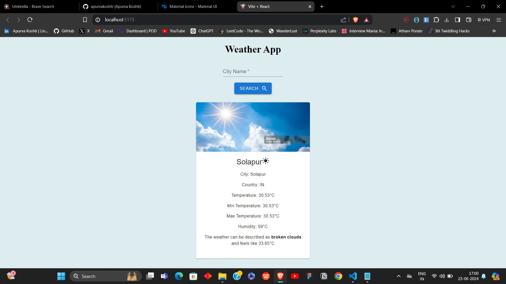

# Weather App

## Project Description
The Weather App is a simple, yet powerful web application that allows users to check the weather conditions of any location. It provides information on country code, temperature, maximum temperature, minimum temperature, humidity, and general weather conditions (e.g., cold, hot, rainy). This application is built using React (Vite) for the frontend and Material UI for styling.

## Features
- **Country Code**: Displays the country code of the selected location.
- **Temperature**: Shows the current temperature.
- **Maximum Temperature**: Displays the maximum temperature for the day.
- **Minimum Temperature**: Displays the minimum temperature for the day.
- **Humidity**: Shows the humidity level.
- **Weather Condition**: Provides a general description of the weather (cold, hot, rainy).

## Technologies Used
- **React (Vite)**: For building the user interface.
- **Material UI**: For styling and UI components.
- **OpenWeatherMap API**: For fetching weather data.

## About Vite
Vite is a modern frontend build tool that significantly improves the development experience. It consists of two major parts:
1. **A development server** that provides rich feature enhancements over native ES modules, such as extremely fast Hot Module Replacement (HMR).
2. **A build command** that bundles your code with Rollup, pre-configured to output optimized static assets for production.
Vite is highly optimized for speed and performance, making it an excellent choice for modern web development.

## Installation and Setup
1. **Clone the repository:**
   - git clone https://github.com/apurvakoshti/Weather-Widget.git
   - cd  mini-react-project
2. **Install Dependencies**
   - npm install
3. **Run the app**
   - npm run dev

## Usage
- Enter the name of the city or location you want to check the weather for.
- Click the "Search" button to fetch and display the weather details.

## Screenshot

## Acknowlegements
- OpenWeatherMap for providing the weather data.
- Material UI for the UI components.
- Vite for the development and build tool.
   
